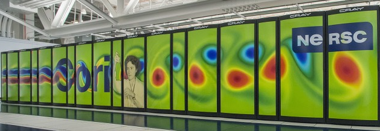

.. _configuration-section:

Configuring an Endpoint
-----------------------

FuncX endpoints are designed to act as gateways to computational resources such as clusters, clouds,
supercomputers, and even your laptop. To make the best use of your resources, the endpoint must be
configured to match the resources' capabilities and to reflect the needs of the workloads you plan to execute.
For example, you may want to limit the number of cores available to your endpoint.

FuncX provides a rich class-based configuration model that allows you to specify the shape of the
resources (# of nodes, # of cores per worker, walltime, etc.) as well as allowing you to place limits on how funcX may
scale the resources in response to changing workload demands.

To generate the appropriate directories and default config template, run the following command::

  $ funcx-endpoint configure <ENDPOINT_NAME>

This command will create a profile for your endpoint in `$HOME/.funcx/<ENDPOINT_NAME>/` and will instantiate a
`config.py` file. This file should be updated with the appropriate configurations for the computational system you are
targeting before you start the endpoint. funcX builds on `Parsl <https://parsl-project.org>`_ and is
configured using a :class:`~funcx_endpoint.endpoint.utils.config.Config` object.
For more information, see the :class:`~funcx_endpoint.endpoint.utils.config.Config` class documentation.

.. note:: If the ENDPOINT_NAME is not specified, a default endpoint named "default" is configured.

.. contents:: Configuration How-To and Examples:

.. note::
   All configuration examples below must be customized for the user's
   allocation, Python environment, file system, etc.

Blue Waters (NCSA)
^^^^^^^^^^^^^^^^^^

.. image:: images/blue-waters-supercomputer.jpg

The following snippet shows an example configuration for executing remotely on Blue Waters, a supercomputer at the National Center for Supercomputing Applications.
The configuration assumes the user is running on a login node, uses the `TorqueProvider` to interface
with the scheduler, and uses the `AprunLauncher` to launch workers.

.. literalinclude:: configs/bluewaters.py

UChicago AI Cluster
^^^^^^^^^^^^^^^^^^^

.. image:: images/ai-science-web.jpeg

The following snippet shows an example configuration for the University of Chicago's AI Cluster.
The configuration assumes the user is running on a login node and uses the `SlurmProvider` to interface
with the scheduler and launch onto the GPUs.

Link to `docs <https://howto.cs.uchicago.edu/slurm:ai>`_.

.. literalinclude:: configs/uchicago_ai_cluster.py

Midway (RCC, UChicago)
^^^^^^^^^^^^^^^^^^^^^^

The Midway cluster is a campus cluster hosted by the Research Computing Center at the University of Chicago.
The snippet below shows an example configuration for executing remotely on Midway.
The configuration assumes the user is running on a login node and uses the `SlurmProvider` to interface
with the scheduler, and uses the `SrunLauncher` to launch workers.

.. literalinclude:: configs/midway.py

Kubernetes Clusters
^^^^^^^^^^^^^^^^^^^

.. image:: images/kuberneteslogo.eabc6359f48c8e30b7a138c18177f3fd39338e05.png

Kubernetes is an open-source system for container management, such as automating deployment and scaling of containers.
The snippet below shows an example configuration for deploying pods as workers on a Kubernetes cluster.
The KubernetesProvider exploits the Python Kubernetes API, which assumes that you have kube config in ``~/.kube/config``.

.. literalinclude:: configs/kube.py

Theta (ALCF)
^^^^^^^^^^^^

.. image:: images/ALCF-Theta_111016-1000px.jpg

The following snippet shows an example configuration for executing on Argonne Leadership Computing Facility's
**Theta** supercomputer. This example uses the `HighThroughputExecutor` and connects to Theta's Cobalt scheduler
using the `CobaltProvider`. This configuration assumes that the script is being executed on the login nodes of Theta.

.. literalinclude:: configs/theta.py

Cori (NERSC)
^^^^^^^^^^^^

The following snippet shows an example configuration for accessing NERSC's **Cori** supercomputer. This example uses the `HighThroughputExecutor` and connects to Cori's Slurm scheduler.
It is configured to request 2 nodes configured with 1 TaskBlock per node. Finally, it includes override information to request a particular node type (Haswell) and to configure a specific Python environment on the worker nodes using Anaconda.

.. literalinclude:: configs/cori.py

Perlmutter (NERSC)
^^^^^^^^^^^^^^^^^^

.. image:: images/Nersc9-image-compnew-sizer7-group-type-4-1.jpg

The following snippet shows an example configuration for accessing NERSC's **Perlmutter** supercomputer. This example uses the `HighThroughputExecutor` and connects to Perlmutters's Slurm scheduler.
It is configured to request 2 nodes configured with 1 TaskBlock per node. Finally, it includes override information to request a particular node type (Haswell) and to configure a specific Python environment on the worker nodes using Anaconda.

.. note:: Please run ``module load cgpu`` prior to executing ``funcx-endpoint start <endpoint_name>``
          on the Cori login nodes to access the Perlmutter queues.

.. literalinclude:: configs/perlmutter.py

Frontera (TACC)
^^^^^^^^^^^^^^^

.. image:: images/frontera-banner-home.jpg

The following snippet shows an example configuration for accessing the Frontera system at TACC. The configuration below assumes that the user is
running on a login node, uses the `SlurmProvider` to interface with the scheduler, and uses the `SrunLauncher` to launch workers.

.. literalinclude:: configs/frontera.py
