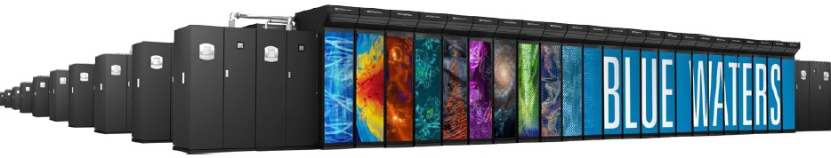
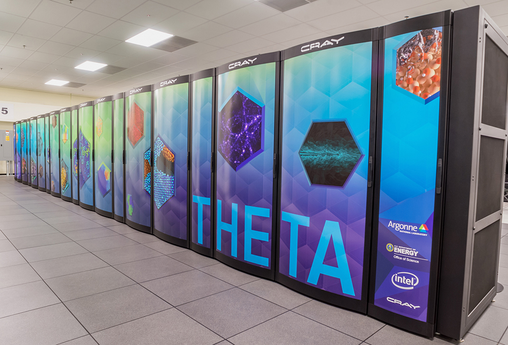
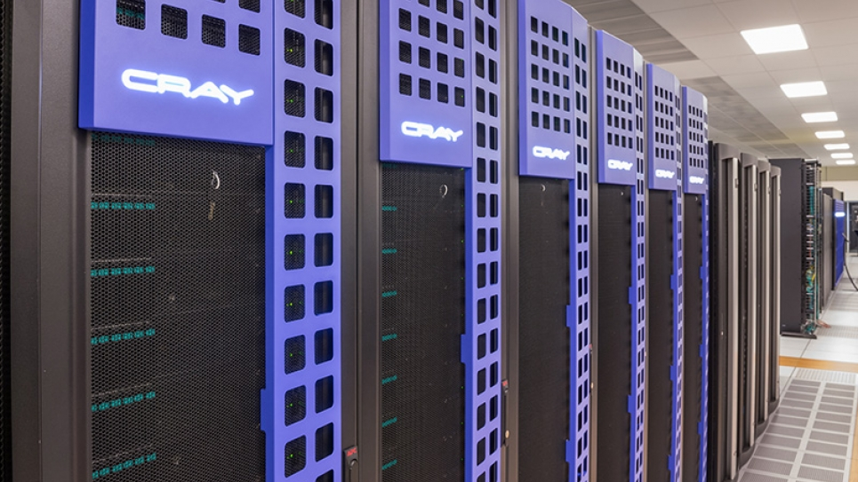
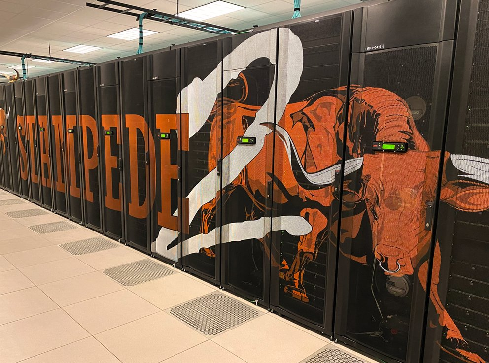

.. _configuration-section:

Globus Compute has been used on various systems around the world. Below are example configurations
for commonly used systems. If you would like to add your system to this list please
contact the Globus Compute Team via Slack.

.. note::
   All configuration examples below must be customized for the user's
   allocation, Python environment, file system, etc.

Anvil (RCAC, Purdue)
^^^^^^^^^^^^^^^^^^^^

.. image:: _static/images/anvil.jpeg

The following snippet shows an example configuration for executing remotely on Anvil, a supercomputer at Purdue University's Rosen Center for Advanced Computing (RCAC). The configuration assumes the user is running on a login node, uses the ``SlurmProvider`` to interface with the scheduler, and uses the ``SrunLauncher`` to launch workers.

.. literalinclude:: configs/anvil.yaml
   :language: yaml

Blue Waters (NCSA)
^^^^^^^^^^^^^^^^^^

The following snippet shows an example configuration for executing remotely on Blue Waters, a supercomputer at the National Center for Supercomputing Applications.
The configuration assumes the user is running on a login node, uses the ``TorqueProvider`` to interface
with the scheduler, and uses the ``AprunLauncher`` to launch workers.

.. literalinclude:: configs/bluewaters.yaml
   :language: yaml

Delta (NCSA)
^^^^^^^^^^^^

.. image:: _static/images/delta_front.png

The following snippet shows an example configuration for executing remotely on Delta, a supercomputer at the National Center for Supercomputing Applications.
The configuration assumes the user is running on a login node, uses the ``SlurmProvider`` to interface
with the scheduler, and uses the ``SrunLauncher`` to launch workers.

.. literalinclude:: configs/delta.yaml
   :language: yaml

Expanse (SDSC)
^^^^^^^^^^^^^^

.. image:: _static/images/expanse.jpeg

The following snippet shows an example configuration for executing remotely on Expanse, a supercomputer at the San Diego Supercomputer Center.
The configuration assumes the user is running on a login node, uses the ``SlurmProvider`` to interface
with the scheduler, and uses the ``SrunLauncher`` to launch workers.

.. literalinclude:: configs/expanse.yaml
   :language: yaml

UChicago AI Cluster
^^^^^^^^^^^^^^^^^^^

.. image:: _static/images/ai-science-web.jpeg

The following snippet shows an example configuration for the University of Chicago's AI Cluster.
The configuration assumes the user is running on a login node and uses the ``SlurmProvider`` to interface
with the scheduler and launch onto the GPUs.

Link to `docs <https://howto.cs.uchicago.edu/slurm:ai>`_.

.. literalinclude:: configs/uchicago_ai_cluster.yaml
   :language: yaml

Here is some Python that demonstrates how to compute the variables in the YAML example above:

.. literalinclude:: configs/uchicago_ai_cluster.py
   :language: python

Midway (RCC, UChicago)
^^^^^^^^^^^^^^^^^^^^^^

.. image:: _static/images/20140430_RCC_8978.jpg

The Midway cluster is a campus cluster hosted by the Research Computing Center at the University of Chicago.
The snippet below shows an example configuration for executing remotely on Midway.
The configuration assumes the user is running on a login node and uses the ``SlurmProvider`` to interface
with the scheduler, and uses the ``SrunLauncher`` to launch workers.

.. literalinclude:: configs/midway.yaml
   :language: yaml

The following configuration is an example to use singularity container on Midway.

.. literalinclude:: configs/midway_singularity.yaml
   :language: yaml

Kubernetes Clusters
^^^^^^^^^^^^^^^^^^^

.. image:: _static/images/kuberneteslogo.eabc6359f48c8e30b7a138c18177f3fd39338e05.png

Kubernetes is an open-source system for container management, such as automating deployment and scaling of containers.
The snippet below shows an example configuration for deploying pods as workers on a Kubernetes cluster.
The KubernetesProvider exploits the Python Kubernetes API, which assumes that you have kube config in ``~/.kube/config``.

.. literalinclude:: configs/kube.yaml
   :language: yaml

Theta (ALCF)
^^^^^^^^^^^^

The following snippet shows an example configuration for executing on Argonne Leadership Computing Facility's
**Theta** supercomputer. This example uses the ``HighThroughputEngine`` and connects to Theta's Cobalt scheduler
using the ``CobaltProvider``. This configuration assumes that the script is being executed on the login nodes of Theta.

.. literalinclude:: configs/theta.yaml
   :language: yaml

The following configuration is an example to use singularity container on Theta.

.. literalinclude:: configs/theta_singularity.yaml
   :language: yaml

Cooley (ALCF)
^^^^^^^^^^^^^

The following snippet shows an example configuration for executing on Argonne Leadership Computing Facility's
**Cooley** cluster. This example uses the ``HighThroughputEngine`` and connects to Cooley's Cobalt scheduler
using the ``CobaltProvider``. This configuration assumes that the script is being executed on the login nodes of Cooley.

.. literalinclude:: configs/cooley.yaml
   :language: yaml

Polaris (ALCF)
^^^^^^^^^^^^^^

.. image:: _static/images/ALCF_Polaris.jpeg

The following snippet shows an example configuration for executing on Argonne Leadership Computing Facility's
**Polaris** cluster. This example uses the ``HighThroughputEngine`` and connects to Polaris's PBS scheduler
using the ``PBSProProvider``. This configuration assumes that the script is being executed on the login node of Polaris.

.. literalinclude:: configs/polaris.yaml
   :language: yaml

Perlmutter (NERSC)
^^^^^^^^^^^^^^^^^^

.. image:: _static/images/Nersc9-image-compnew-sizer7-group-type-4-1.jpg

The following snippet shows an example configuration for accessing NERSC's **Perlmutter** supercomputer. This example uses the ``HighThroughputEngine`` and connects to Perlmutters's Slurm scheduler.
It is configured to request 2 nodes configured with 1 TaskBlock per node. Finally, it includes override information to request a particular node type (GPU) and to configure a specific Python environment on the worker nodes using Anaconda.

.. literalinclude:: configs/perlmutter.yaml
   :language: yaml

Frontera (TACC)
^^^^^^^^^^^^^^^

.. image:: _static/images/frontera-banner-home.jpg

The following snippet shows an example configuration for accessing the Frontera system at TACC. The configuration below assumes that the user is
running on a login node, uses the ``SlurmProvider`` to interface with the scheduler, and uses the ``SrunLauncher`` to launch workers.

.. literalinclude:: configs/frontera.yaml
   :language: yaml

Bebop (LCRC, ANL)
^^^^^^^^^^^^^^^^^

.. image:: _static/images/Bebop.jpeg

The following snippet shows an example configuration for accessing the Bebop system at Argonne's LCRC. The configuration below assumes that the user is
running on a login node, uses the ``SlurmProvider`` to interface with the scheduler, and uses the ``SrunLauncher`` to launch workers.

.. literalinclude:: configs/bebop.yaml
   :language: yaml

Bridges-2 (PSC)
^^^^^^^^^^^^^^^

.. image:: _static/images/bridges-2.png

The following snippet shows an example configuration for accessing the Bridges-2 system at PSC. The configuration below assumes that the user is
running on a login node, uses the ``SlurmProvider`` to interface with the scheduler, and uses the ``SrunLauncher`` to launch workers.

.. literalinclude:: configs/bridges-2.yaml
   :language: yaml

Stampede2 (TACC)
^^^^^^^^^^^^^^^^

The following snippet shows an example configuration for accessing the Stampede2 system at the Texas Advanced Computing Center (TACC).
The configuration below assumes that the user is running on a login node, uses the ``SlurmProvider`` to interface with the scheduler,
and uses the ``SrunLauncher`` to launch workers.

.. literalinclude:: configs/stampede2.yaml
   :language: yaml

FASTER (TAMU)
^^^^^^^^^^^^^

The following snippet shows an example configuration for accessing the FASTER system at
Texas |nbsp| A |nbsp| & |nbsp| M |nbsp| (TAMU).  The configuration below assumes that
the user is running on a login node, uses the ``SlurmProvider`` to interface with the
scheduler, and uses the ``SrunLauncher`` to launch workers.

.. literalinclude:: configs/faster.yaml
   :language: yaml

Pinning Workers to devices
^^^^^^^^^^^^^^^^^^^^^^^^^^

Many modern clusters provide multiple accelerators per compute note, yet many applications are best suited to using a
single accelerator per task. Globus Compute supports pinning each worker to different accelerators using the ``available_accelerators``
option of the ``HighThroughputEngine``. Provide either the number of accelerators (Globus Compute will assume they are named
in integers starting from zero) or a list of the names of the accelerators available on the node. Each Globus Compute worker
will have the following environment variables set to the worker specific identity assigned:
``CUDA_VISIBLE_DEVICES``, ``ROCR_VISIBLE_DEVICES``, ``SYCL_DEVICE_FILTER``.

.. literalinclude:: configs/worker_pinning.yaml
   :language: yaml

.. |nbsp| unicode:: 0xA0
   :trim:
