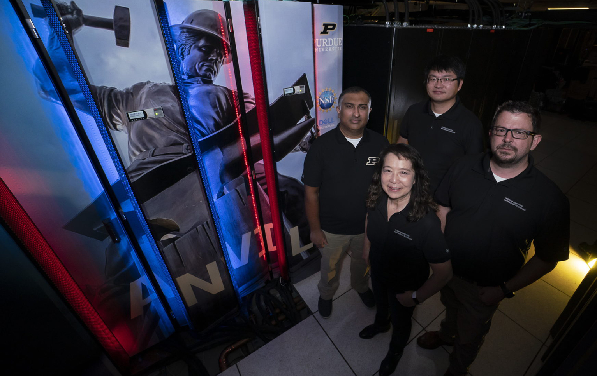
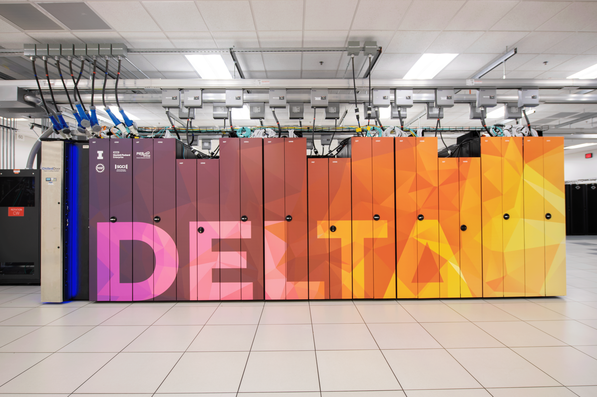
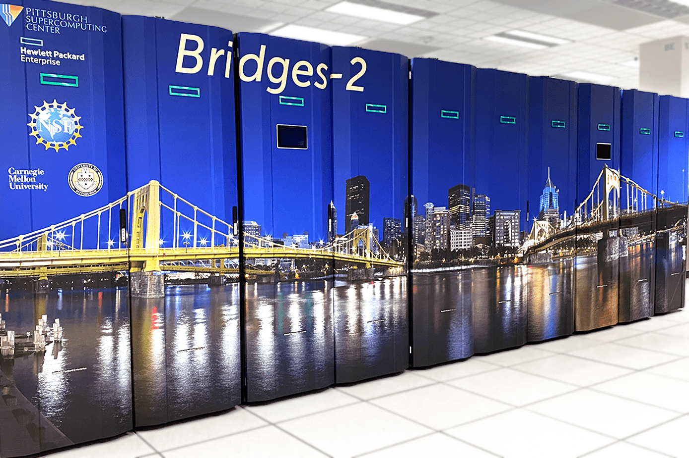

Example Configurations
**********************

.. _configuration-section:

While Globus Compute is in use on various systems around the world, getting to a working
configuration that matches the underlying system constraints and the requirements of the
site-administrator often takes trial and error.  Below are example configurations for some
well-known systems that are known to work.  These serve as a reference for getting
started.

If you would like to add your system to this list please contact the Globus Compute Team
via `Slack <https://funcx.slack.com/>`_.  (The `#help channel`_ is a good place to
start.)

.. note::
   All configuration examples below must be customized for the user's
   allocation, Python environment, file system, etc.

Anvil (RCAC, Purdue)
^^^^^^^^^^^^^^^^^^^^

The following snippet shows an example configuration for executing remotely on Anvil, a
supercomputer at Purdue University's Rosen Center for Advanced Computing (RCAC).  The
configuration assumes the user is running on a login node, uses the ``SlurmProvider`` to
interface with the scheduler, and uses the ``SrunLauncher`` to launch workers.

.. literalinclude:: configs/anvil.yaml
   :language: yaml

Delta (NCSA)
^^^^^^^^^^^^

The following snippet shows an example configuration for executing remotely on Delta, a
supercomputer at the National Center for Supercomputing Applications.  The configuration
assumes the user is running on a login node, uses the ``SlurmProvider`` to interface
with the scheduler, and uses the ``SrunLauncher`` to launch workers.

.. literalinclude:: configs/delta.yaml
   :language: yaml

Expanse (SDSC)
^^^^^^^^^^^^^^

The following snippet shows an example configuration for executing remotely on Expanse,
a supercomputer at the San Diego Supercomputer Center.  The configuration assumes the
user is running on a login node, uses the ``SlurmProvider`` to interface with the
scheduler, and uses the ``SrunLauncher`` to launch workers.

.. literalinclude:: configs/expanse.yaml
   :language: yaml

The |GlobusMPIEngine|_ adds support for running MPI applications. The following snippet
shows an example configuration for Expanse that uses the ``SlurmProvider`` to provision
batch jobs each with 4 nodes, which can be dynamically partitioned to launch
MPI functions with ``srun``.

.. literalinclude:: configs/expanse_mpi.yaml
   :language: yaml

UChicago AI Cluster
^^^^^^^^^^^^^^^^^^^

The following snippet shows an example configuration for the University of Chicago's AI
Cluster.  The configuration assumes the user is running on a login node and uses the
``SlurmProvider`` to interface with the scheduler and launch onto the GPUs.

Link to `docs <https://howto.cs.uchicago.edu/slurm:ai>`_.

.. literalinclude:: configs/uchicago_ai_cluster.yaml
   :language: yaml

Here is some Python that demonstrates how to compute the variables in the YAML example
above:

.. literalinclude:: configs/uchicago_ai_cluster.py
   :language: python

Midway (RCC, UChicago)
^^^^^^^^^^^^^^^^^^^^^^

.. image:: ../_static/images/20140430_RCC_8978.jpg

The Midway cluster is a campus cluster hosted by the Research Computing Center at the
University of Chicago.  The snippet below shows an example configuration for executing
remotely on Midway.  The configuration assumes the user is running on a login node and
uses the ``SlurmProvider`` to interface with the scheduler, and uses the
``SrunLauncher`` to launch workers.

.. literalinclude:: configs/midway.yaml
   :language: yaml

The following configuration example uses an Apptainer (formerly Singularity) container
on Midway.

.. literalinclude:: configs/midway_apptainer.yaml
   :language: yaml

Kubernetes Clusters
^^^^^^^^^^^^^^^^^^^

.. image:: ../_static/images/kuberneteslogo.eabc6359f48c8e30b7a138c18177f3fd39338e05.png

Kubernetes is an open-source system for container management, such as automating
deployment and scaling of containers.  The snippet below shows an example configuration
for deploying pods as workers on a Kubernetes cluster.  The KubernetesProvider exploits
the Python Kubernetes API, which assumes that you have kube config in
``~/.kube/config``.

.. literalinclude:: configs/kube.yaml
   :language: yaml

Polaris (ALCF)
^^^^^^^^^^^^^^

.. image:: ../_static/images/ALCF_Polaris.jpeg

The following snippet shows an example configuration for executing on Argonne Leadership
Computing Facility's **Polaris** cluster. This example uses the ``GlobusComputeEngine``
and connects to Polaris's PBS scheduler using the ``PBSProProvider``.  This
configuration assumes that the script is being executed on the login node of Polaris.

.. literalinclude:: configs/polaris.yaml
   :language: yaml

Perlmutter (NERSC)
^^^^^^^^^^^^^^^^^^

The following snippet shows an example configuration for accessing NERSC's
**Perlmutter** supercomputer.  This example uses the ``GlobusComputeEngine`` and
connects to Perlmutters's Slurm scheduler.  It is configured to request 2 nodes
configured with 1 TaskBlock per node. Finally, it includes override information to
request a particular node type (GPU) and to configure a specific Python environment on
the worker nodes using Anaconda.

.. literalinclude:: configs/perlmutter.yaml
   :language: yaml

Frontera (TACC)
^^^^^^^^^^^^^^^

.. image:: ../_static/images/frontera-banner-home.jpg

The following snippet shows an example configuration for accessing the Frontera system
at TACC.  The configuration below assumes that the user is running on a login node, uses
the ``SlurmProvider`` to interface with the scheduler, and uses the ``SrunLauncher`` to
launch workers.

.. literalinclude:: configs/frontera.yaml
   :language: yaml

Bebop (LCRC, ANL)
^^^^^^^^^^^^^^^^^

.. image:: ../_static/images/Bebop.jpeg

The following snippet shows an example configuration for accessing the Bebop system at
Argonne's LCRC.  The configuration below assumes that the user is running on a login
node, uses the ``SlurmProvider`` to interface with the scheduler, and uses the
``SrunLauncher`` to launch workers.

.. literalinclude:: configs/bebop.yaml
   :language: yaml

Bridges-2 (PSC)
^^^^^^^^^^^^^^^

The following snippet shows an example configuration for accessing the Bridges-2 system
at PSC.  The configuration below assumes that the user is running on a login node, uses
the ``SlurmProvider`` to interface with the scheduler, and uses the ``SrunLauncher`` to
launch workers.

.. literalinclude:: configs/bridges-2.yaml
   :language: yaml

FASTER (TAMU)
^^^^^^^^^^^^^

The following snippet shows an example configuration for accessing the FASTER system at
Texas |nbsp| A |nbsp| & |nbsp| M |nbsp| (TAMU).  The configuration below assumes that
the user is running on a login node, uses the ``SlurmProvider`` to interface with the
scheduler, and uses the ``SrunLauncher`` to launch workers.

.. literalinclude:: configs/faster.yaml
   :language: yaml

Open Science Pool
^^^^^^^^^^^^^^^^^

The `Open Science Pool <https://osg-htc.org/services/open_science_pool.html>`_ is a pool of opportunistic
computing resources operated for all US-associated open science by the
`OSG consortium <https://osg-htc.org/about/introduction/>`_.
Unlike traditional HPC clusters, these computational resources are offered from campus and research cluster
resources that are loosely connected. The configuration below uses the ``CondorProvider``
to interface with the scheduler, and uses ``apptainer`` to distribute the computational environment
to the workers.

.. warning::
   ``GlobusComputeEngine`` relies on a shared-filesystem to distribute keys used for encrypting
   communication between the endpoint and workers. Since OSPool does not support a writable
   shared-filesystem, **encryption** is disabled in the configuration below.

.. literalinclude:: configs/ospool.yaml
   :language: yaml

Stampede3 (TACC)
^^^^^^^^^^^^^^^^

`Stampede3 <https://tacc.utexas.edu/systems/stampede3/>`_ is a Dell technologies and Intel based supercomputer at the
`Texas Advanced Computing Center (TACC) <https://tacc.utexas.edu/>`_. The following snippet shows an example
configuration that uses the ``SlurmProvider`` to interface with the batch scheduler, and uses the ``SrunLauncher``
to launch workers across nodes.

.. literalinclude:: configs/stampede3.yaml
   :language: yaml

Pinning Workers to devices
^^^^^^^^^^^^^^^^^^^^^^^^^^

Many modern clusters provide multiple accelerators per compute note, yet many
applications are best suited to using a single accelerator per task.  Globus Compute
supports pinning each worker to different accelerators using the
``available_accelerators`` option of the ``GlobusComputeEngine``.  Provide either the
number of accelerators (Globus Compute will assume they are named in integers starting
from zero) or a list of the names of the accelerators available on the node.  Each
Globus Compute worker will have the following environment variables set to the worker
specific identity assigned: ``CUDA_VISIBLE_DEVICES``, ``ROCR_VISIBLE_DEVICES``,
``SYCL_DEVICE_FILTER``.

.. literalinclude:: configs/worker_pinning.yaml
   :language: yaml

.. |nbsp| unicode:: 0xA0
   :trim:

.. _#help channel: https://funcx.slack.com/archives/C017637NZFA

.. |GlobusComputeEngine| replace:: ``GlobusComputeEngine``
.. _GCEngine: reference/engine.html
.. |HighThroughputExecutor| replace:: ``HighThroughputExecutor``
.. _HighThroughputExecutor: https://parsl.readthedocs.io/en/stable/stubs/parsl.executors.HighThroughputExecutor.html

.. |GlobusMPIEngine| replace:: ``GlobusMPIEngine``
.. _GlobusMPIEngine: reference/mpi_engine.html