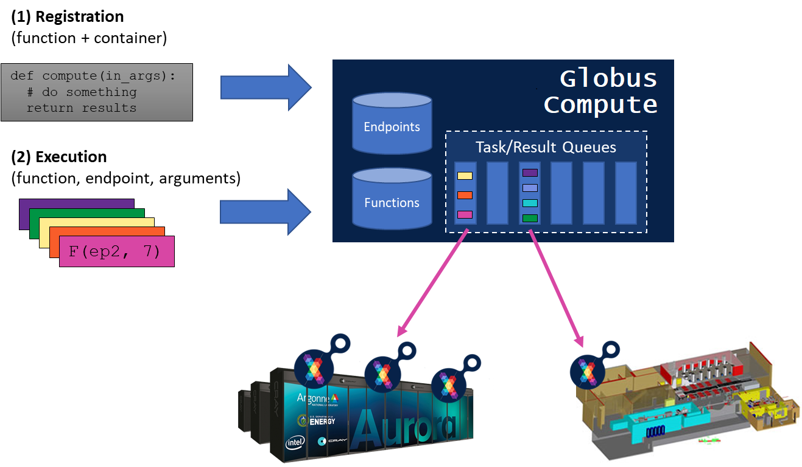

.. Globus Compute documentation master file, created by
   sphinx-quickstart on Mon Jul  1 11:43:54 2019.
   You can adapt this file completely to your liking, but it should at least
   contain the root `toctree` directive.

Globus Compute - Federated Function as a Service
#########################################

Globus Compute is a distributed Function as a Service (FaaS) platform
that enables flexible, scalable, and high performance remote function execution.
Unlike centralized FaaS platforms, Globus Compute allows users to execute
functions on heterogeneous remote computers, from laptops to campus clusters, clouds,
and supercomputers.

Globus Compute is composed of two core components:

* The Globus Compute cloud-hosted service provides an available, reliable, and secure interface for registering, sharing, and executing functions on remote endpoints. It implements a fire-and-forget model via which the cloud service is responsible for securely communicating with endpoints to ensure functions are successfully executed.

* Globus Compute endpoints transform existing laptops, clouds, clusters, and supercomputers into function serving systems.  Endpoints are registered by installing the Globus Compute endpoint software and configuring it for the target system.

Globus Compute model
^^^^^^^^^^^^^^^^^^

Globus Compute works like other FaaS platforms: users first register a function with
Globus Compute by specifying the function body (in Python), they may then execute that
function by specifying the function ID and input arguments. Unlike traditional
FaaS platforms, users also specify the endpoint ID on which they wish to execute
the function.

Globus Compute endpoints are user-managed and may be configured on a wide range of resources
from laptops and scientific instruments through to supercomputers. The Globus Compute endpoint
can be configured to execute functions locally (i.e., using multiple processes) or
on connected computing resources (i.e., by provisioning and managing compute nodes
from a batch scheduler or cloud API).

Globus Compute implements a reliable fire-and-forget execution model. After invoking a function,
a user can close their laptop and rely on Globus Compute to manage the execution and store the
results. Globus Compute securely communicates with remote endpoints, waits for resources
to become available, and can even retry execution upon failure. Globus Compute stores results (or
errors) in the cloud-hosted service until they are retrieved by the user.

Using Globus Compute
^^^^^^^^^^^^^^^^^^

Globus Compute offers a Python SDK for registering, sharing, and executing functions.
The following code block examples how Globus Compute can be used to execute a "hello
world" function on a remote endpoint.

.. code-block:: python

    from globus_compute_sdk import Executor

    def hello_world():
        return "Hello World!"

    tutorial_endpoint_id = '4b116d3c-1703-4f8f-9f6f-39921e5864df'
    with Executor(endpoint_id=tutorial_endpoint_id) as fxe:
        future = fxe.submit(hello_world)
        print(future.result())

Deploying an endpoint
^^^^^^^^^^^^^^^^^^^^^^^

A Globus Compute endpoint can be created by installing the Globus Compute endpoint software
and configuring it for the target resources. The following steps show
how to download and configure an endpoint for local (multi-process) execution. ::

  $ python3 -m pipx install globus-compute-endpoint

  $ globus-compute-endpoint configure

  $ globus-compute-endpoint start <ENDPOINT_NAME>

.. toctree::
   :hidden:
   :maxdepth: 2
   :caption: Contents:

   quickstart
   executor
   sdk
   endpoints
   Tutorial
   actionprovider
   reference/index
   limits
   changelog

Indices and tables
==================

* :ref:`genindex`
